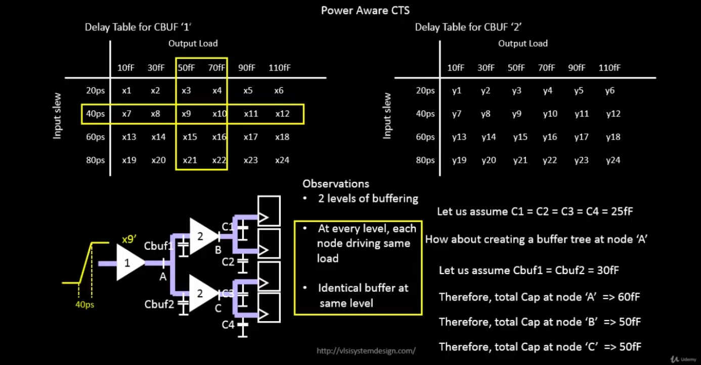
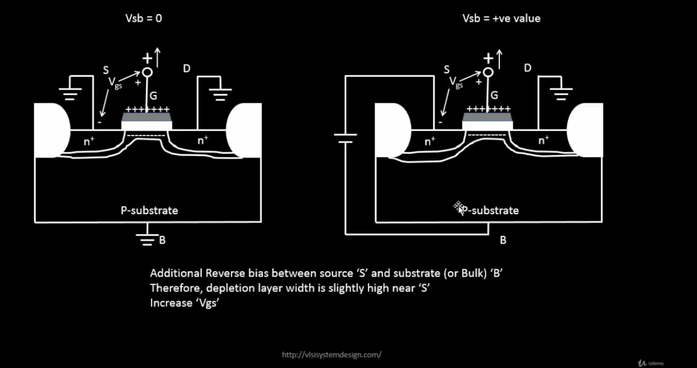

# VSD Hardware Design Program

## Velocity Saturation and basics of CMOS inverter VTC

### 📚 Contents

- [SPICE Simulation for Lower Nodes](#spice-simulation-for-lower-nodes)
  - [Observation 1: Long Channel vs. Short Channel NMOS Characteristics](#observation-1-long-channel-vs-short-channel-nmos-characteristics)
  - [Observation 2: Peak Current Comparison — Long Channel vs Short Channel Devices](#observation-2-peak-current-comparison--long-channel-vs-short-channel-devices)
- [Labs: Sky130 Id-Vgs](#labs-sky130-id-vgs)
- [CMOS Voltage Transfer Characteristics](#cmos-voltage-transfer-characteristics)
- [CMOS Inverter — Transistor-Level and Switch-Level View](#cmos-inverter--transistor-level-and-switch-level-view)
- [Load Line Curves for NMOS and PMOS](#load-line-curves-for-nmos-and-pmos)

### `SPICE simulation for lower nodes`

The plot below shows the output characteristics of an NMOS device with W=1.8μm, L=1.2μm (W/L = 1.5).


**Linear Region:**  
  The drain current (Id) is a linear function of Vds in this region.  
  It is defined for Vds < (Vgs - Vt).

**Saturation Region:**  
  The drain current (Id) depends on channel length modulation and Vds.  
  It is defined for Vds ≥ (Vgs - Vt).

The region **before** Vds = Vgs - Vt is the **Linear Region**, where Id varies linearly with Vds.  
The region **after** Vds = Vgs - Vt is the **Saturation Region**, where Id is influenced by channel length modulation and Vds.

#### Observation 1: Long Channel vs. Short Channel NMOS Characteristics

The plot below compares NMOS output characteristics for long channel and short channel devices with **same W/L ratio**:


In this figure, the **left plot** corresponds to a device with W = 1.8μm and L = 1.2μm (long-channel device), and the **right plot** corresponds to W = 0.375μm and L = 0.25μm (short-channel device). 

Since the channel length is < 0.25μm in the second case, it is classified as a short-channel device.

Both devices have the **same W/L ratio**, but different absolute Width (W) and Length (L), allowing us to compare their electrical behavior directly.

When we apply a constant Vds and sweep Vgs:

> In **long-channel devices**, the drain current (Id) shows an **ideal quadratic dependence on Vgs**.

> In **short-channel devices**, Id remains quadratic at low Vgs but gradually becomes **linear at higher Vgs**. This is due to **velocity saturation**, which limits carrier velocity as the electric field increases. Once the carrier velocity reaches its maximum limit (velocity saturation), the Id-Vgs curve flattens into a linear region.

Thus, this plot clearly demonstrates how **velocity saturation** alters the Id behavior in short-channel devices — causing a transition from quadratic to linear dependence at higher Vgs.


For long-channel devices, drain current shows a quadratic dependence on gate voltage.

For short-channel devices, it is quadratic at low gate voltage but becomes linear at higher voltages due to velocity saturation.



At lower electric fields, carrier velocity increases linearly with the electric field.

At higher electric fields, velocity saturates and becomes constant due to velocity saturation.


For **Long Channel (> 250 nm)** devices:
  - Modes: Cutoff → Resistive → Saturation

For **Short Channel (< 250 nm)** devices:
  - Modes: Cutoff → Resistive → **Velocity Saturation** → Saturation
  - An additional mode appears due to **velocity saturation** effects in short channel devices.


#### Observation 2: Peak Current Comparison — Long Channel vs Short Channel Devices

The figure below compares the **peak drain current (Id)** between a long-channel and short-channel NMOS device:


**Left Plot**: W = 1.8μm, L = 1.2μm → **Long-channel device**
  - Peak current = **410 μA**
  
**Right Plot**: W = 0.375μm, L = 0.25μm → **Short-channel device**
  - Peak current = **210 μA**

Even though **short-channel devices** allow for faster switching and smaller sizes, their **peak drain current (Id)** is lower than long-channel devices.

The reduction in peak current is due to **velocity saturation** — which limits carrier velocity in short-channel devices.

In long-channel devices, carriers accelerate freely, giving higher Id.

 ### `Labs Sky130 Id-Vgs`

 <details> <summary><strong>day2_nfet_idvds_L015_W039.spice </strong></summary>

```
  *Model Description
  .param temp=27

  *Including sky130 library files
  .lib "sky130_fd_pr/models/sky130.lib.spice" tt

  *Netlist Description
   XM1 Vdd n1 0 0 sky130_fd_pr__nfet_01v8 w=0.39 l=0.15
   R1 n1 in 55
   Vdd vdd 0 1.8V
   Vin in 0 1.8V

  *simulation commands
   .op
   .dc Vdd 0 1.8 0.1 Vin 0 1.8 0.2

   .control

   run
   display
   setplot dc1
   .endc
   .end
```
</details>

📈**plot the waveforms in ngspice**

```shell
ngspice day2_nfet_idvds_L015_W039.spice 
plot -vdd#branch
```

**The plot of Ids vs Vds over constant Vgs:**


 <details> <summary><strong>day2_nfet_idvgs_L015_W039.spice </strong></summary>

```
    *Model Description
   .param temp=27

   *Including sky130 library files
   .lib "sky130_fd_pr/models/sky130.lib.spice" tt

   *Netlist Description
    XM1 Vdd n1 0 0 sky130_fd_pr__nfet_01v8 w=0.39 l=0.15
    R1 n1 in 55
    Vdd vdd 0 1.8V
    Vin in 0 1.8V

    *simulation commands
     .op
    .dc Vin 0 1.8 0.1 

    .control

     run
     display
     setplot dc1
     .endc
     .end
```
</details>

📈**plot the waveforms in ngspice**

```shell
ngspice day2_nfet_idvgs_L015_W039.spice
plot -vdd#branch
```

**The plot of Ids vs Vgs over constant Vds:**


### `CMOS voltage Transfer Characteristics`

**MOSFET as a Switch:**

- **OFF State:**  
  The MOSFET behaves as an **open switch** (infinite OFF resistance) when:  
  _|Vgs| < |Vth|_

- **ON State:**  
  The MOSFET behaves as a **closed switch** (finite ON resistance) when:  
  _|Vgs| > |Vth|_



### `CMOS Inverter — Transistor-Level and Switch-Level View`

The figure below shows the **CMOS inverter** in both **transistor-level** and **switch-level** representations:


The **left diagram** shows a CMOS inverter at the transistor level: the **PMOS** transistor is connected to Vdd, the **NMOS** transistor is connected to Vss, and **Vin** is applied to both gates. The output **Vout** is taken from the common drain node, with CL representing the load capacitance.

The **middle diagram** illustrates the switch model when **Vin = Vdd**: the NMOS transistor is ON (acting as a resistor Rn), while the PMOS is OFF (open switch), resulting in **Vout = 0**.

The **right diagram** shows the switch model when **Vin = 0**: the PMOS transistor is ON (acting as a resistor Rp), while the NMOS is OFF (open switch), producing **Vout = Vdd**.

> When **Vin = Vdd → Vout = 0** (NMOS ON, PMOS OFF)

> When **Vin = 0 → Vout = Vdd** (PMOS ON, NMOS OFF)

This basic **CMOS inverter** behavior is the foundation of all CMOS logic circuits — demonstrating **low static power** and **sharp transitions** in the voltage transfer characteristics.

### `Load Line Curves for NMOS and PMOS`

> **Step 1**

Convert the **PMOS gate-source voltage (VgsP)** into an equivalent **Vin**.

Replace all internal node voltages with **Vin**, **Vdd**, **Vss**, and **Vout**.


> **Step 2 & Step 3**

Convert PMOS and NMOS drain-source voltages to **Vout**.


> **Step 4**

Merge the NMOS and PMOS load curves by equating their Ids characteristics with respect to **Vout**.  

Plot the **Voltage Transfer Characteristic (VTC)** by sweeping **Vin** and mapping the corresponding **Vout**, showing the inverter switching behavior from logic HIGH to LOW.


