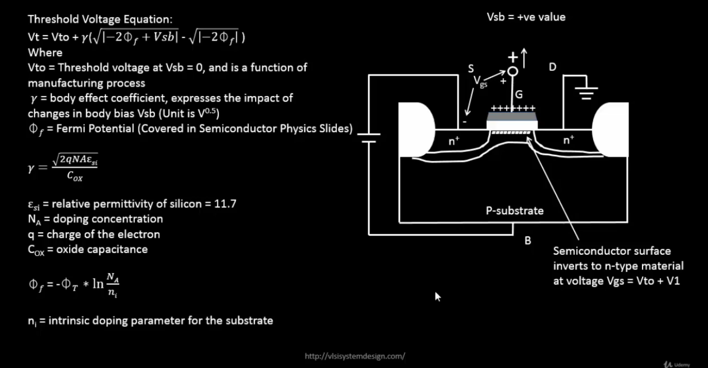

# VSD Hardware Design Program

## CMOS Circuit Design and SPICE Simulations

### 📚 Contents

1. **Introduction to Circuit Design and SPICE simulations**
    - [SPICE Simulations in Electronic Circuit Design](#spice-simulations-in-electronic-circuit-design)
    - [Why Use SPICE Simulations?](#why-use-spice-simulations)
    - [Example: Inverter Circuit](#example-inverter-circuit)
    - [Role of SPICE in Inverter Design](#role-of-spice-in-inverter-design)
    - [CMOS Inverter Circuit Diagram](#cmos-inverter-circuit-diagram)
    - [Operation Summary](#operation-summary)
    - [SPICE Simulation Results](#spice-simulation-results)
    - [Understanding Delay Tables](#understanding-delay-tables)
    - [Delay Calculation from LUTs](#delay-calculation-from-luts)
      
2. **NMOS resistive region and saturation region of operation**
    - [Introduction to Basic Element in Circuit Design - NMOS Transistor](#introduction-to-basic-element-in-circuit-design---nmos-transistor)
    - [NMOS Transistor - Body Effect (Substrate Bias Effect)](#nmos-transistor---body-effect-substrate-bias-effect)
    - [NMOS Resistive region of operation with small drain-source voltage](#nmos-resistive-region-of-operation-with-small-drain-source-voltage)
    - [Drift current theory](#drift-current-theory)
    - [Drain current model for linear region of operation](#drain-current-model-for-linear-region-of-operation)
    - [Pinch-off Region Condition](#pinch-off-region-condition)
    - [Drain Current Model for Saturation Region of Operation](#drain-current-model-for-saturation-region-of-operation)

3. **Introduction to SPICE**
    - [Basic SPICE Setup](#basic-spice-setup)
    - [Circuit description in SPICE syntax](#circuit-description-in-spice-syntax)
    - [SPICE Lab with sky130 models](#spice-lab-with-sky130-models)
   
### `SPICE Simulations in Electronic Circuit Design`

SPICE (Simulation Program with Integrated Circuit Emphasis) simulations are a vital tool in electronic circuit design. They allow us to test and verify circuits before building them, ensuring they function correctly and efficiently.

### `Why Use SPICE Simulations?`

1. **Verify Circuit Functionality:**
   - Ensure that circuits, like logic gates, perform as expected.

2. **Analyze Performance:**
   - Check speed and signal delays to confirm the circuit meets timing requirements.

3. **Evaluate Power Consumption:**
   - Assess how much power the circuit uses and optimize for energy efficiency.

4. **Optimize Design:**
   - Experiment with different configurations to improve circuit performance.

#### `Example: Inverter Circuit`

An inverter is a simple circuit that reverses the input signal:

- **Setup:**
  - Uses two transistors: PMOS and NMOS.
  - PMOS connects to the power supply (VDD), NMOS connects to ground (GND).
  - Both transistors have their gates connected to the input and their drains connected to the output.

- **Operation:**
  - When the input is high, the NMOS transistor conducts, making the output low.
  - When the input is low, the PMOS transistor conducts, making the output high.

#### `Role of SPICE in Inverter Design`

- **Functionality Check:**
  - Verify that the inverter correctly flips the input signal.

- **Timing Analysis:**
  - Measure how quickly the inverter responds to changes in the input.

- **Power Analysis:**
  - Determine the power usage of the inverter during operation.

SPICE simulations are essential for designing circuits that are reliable and efficient. They help identify issues early and allow for optimization before the physical circuit is built.

### `CMOS Inverter Circuit Diagram`


This schematic shows a standard **CMOS inverter**:
- **Vin** is applied to both PMOS and NMOS gates.
- **Vout** is taken at the common drain node.
- **PMOS** connects from **VDD** to the output.
- **NMOS** connects from the output to **VSS (GND)**.
- **CL** represents the load capacitance, mimicking the next stage or parasitic load.

#### `Operation Summary`

| Vin       | PMOS State | NMOS State | Vout     |
|-----------|------------|------------|----------|
| Low (0 V) | ON         | OFF        | High (VDD) |
| High (VDD)| OFF        | ON         | Low (GND)  |

This forms the basis of digital NOT gates used in logic families.

#### `SPICE Simulation Results`


The `top graph` indicates the current-voltage `(I-V) characteristics` of a CMOS inverter. It shows the relationship between the drain-source current (Ids) and the output voltage (Vout) for various input voltages (Vin).

The `bottom graph` indicates the `voltage transfer characteristics (VTC)` of a CMOS inverter, showing how the output voltage (Vout) varies with the input voltage (Vin) to analyze the inverter's switching behavior and logic levels.

### `Understanding Delay Tables`

In digital timing analysis, **cell delay** is not a fixed number—it depends on two main factors:
- **Input Slew (transition time of the input signal)**
- **Output Load (capacitive load at the output)**

The delay values are stored in **2D LUTs (Lookup Tables)** as shown below.


**Delay Table Structure:**

Each buffer cell (CBUF) has a delay table indexed by:
- Rows → Input Slew (e.g., 20ps, 40ps, 60ps, 80ps)
- Columns → Output Load (e.g., 10fF to 110fF)

Example tables shown:
- **CBUF1:** Delay values `x1–x24`
- **CBUF2:** Delay values `y1–y24`

This table helps STA tools interpolate the **actual delay** for a cell based on current slew and load.

**Total Capacitance Calculation:**

If a cell output pin drives multiple fanout cells, the total capacitance on the output pin of the cell is the sum of all the input capacitances of the cells that it is driving plus the sum of the capacitance of all the wire segments that comprise the net plus the output capacitance of the driving cell. Note that in a CMOS cell, the inputs to the cell present a capacitive load only.


| Node | What It Drives            | Capacitance Calculation | Total Cap |
| ---- | ------------------------- | ----------------------- | --------- |
| A    | 2 CBUF2's                  | 30fF + 30fF             | 60fF      |
| B    | Load capacitors C1 and C2 | 25fF + 25fF             | 50fF      |
| C    | Load capacitors C3 and C4 | 25fF + 25fF             | 50fF      |

**Illustrative Scenario:** The figure below illustrates a scenario where a logic gate **G1** drives three other gates (**G2**, **G3**, and **G4**) through a shared interconnect network. The net includes multiple parasitic capacitances due to interconnect segments.


The **total capacitance seen at the output of G1** is the sum of:
- The **output pin capacitance** of G1 itself (`Cout(G1)`)
- The **input pin capacitances** of the driven gates: `Cin(G2)`, `Cin(G3)`, and `Cin(G4)`
- The **parasitic capacitances** of the interconnect segments: `Cs1`, `Cs2`, `Cs3`, and `Cs4`

`C_total (Output of G1) = Cout(G1) + Cin(G2) + Cin(G3) + Cin(G4) + Cs1 + Cs2 + Cs3 + Cs4`

####  `Delay Calculation from LUTs`

In practical timing analysis, it’s rare for the exact **input slew** and **output load** values to match the entries in a cell’s **delay lookup table (LUT)**. To estimate delays for intermediate values, **linear interpolation** is used.

In the example below, we want to estimate the delay for **CBUF1** when:

- **Input Slew** = `40ps`
- **Output Load** = `60fF`

However, `60fF` is not explicitly listed in the LUT. The closest columns are:

- `50fF` → delay = `x9`
- `70fF` → delay = `x10`

To estimate the delay at `60fF`, we perform linear interpolation between `x9` and `x10`.

Delay_60fF = x9 + [(60fF - 50fF) / (70fF - 50fF)] * (x10 - x9)


In the example below, we want to estimate the delay for **CBUF2** when:

- **Input Slew** = `60ps`
- **Output Load** = `50fF`

Fortunately, `50fF` is explicitly listed in the LUT, so no interpolation is needed for the load. We can directly pick the delay value from the table.

From the CBUF2 delay table:
- Row for `60ps` input slew
- Column for `50fF` output load
- Corresponding delay = `y15`

Therefore, the delay of CBUF2 under these conditions is taken directly as `y15`.


ℹ️**Note:** If the required input slew or output load falls **outside the bounds** of the LUT (e.g., >110fF or <10fF), then **extrapolation** is used. However, extrapolated values are **less accurate** and can deviate from actual SPICE results. Designers should aim to stay within the characterized table ranges whenever possible for reliable STA.


### `Introduction to Basic Element in Circuit Design - NMOS Transistor`

This image shows the structure of an NMOS transistor with its key components and terminals labeled.


This image shows the NMOS transistor when **Vgs = 0**


This image shows the NMOS transistor when **Vgs > Vth (threshold voltage)**:


### `NMOS Transistor - Body Effect (Substrate Bias Effect)`

This image compares NMOS operation with **Vsb = 0** and **Vsb = positive value**:

- On the left: when **Vsb = 0**, normal channel formation happens as Vgs increases.
- On the right: when **Vsb > 0**, an **additional reverse bias** is introduced between Source and Body (substrate).  
  → This increases the threshold voltage (Vth).  
  → The depletion layer near Source becomes wider.  
  → More Vgs is required to turn ON the transistor (stronger inversion).

This effect is known as the **Body Effect** or **Substrate Bias Effect**. 

<p align="center">
  
</p>




**γ (Body Effect Coefficient)** and **Φ<sub>f</sub> (Fermi Potential)** are constants provided by the foundry, which characterize the physical properties of the transistor. These constants are used by **SPICE simulators** to model the device behavior under various body bias conditions and enable accurate circuit simulations.

### `NMOS Resistive region of operation with small drain-source voltage`

Resistive Region of Operation (V<sub>GS</sub> > V<sub>t</sub>, small V<sub>DS</sub>)


At this stage:

- The channel is formed (strong inversion), and charge carriers flow from source to drain.
- The gate-to-channel voltage at a point ‘x’ along the channel is: **V<sub>GS</sub> - V(x)**.
- The **induced charge density (Q<sub>i</sub>)** in the channel is proportional to **(V<sub>GS</sub> - V<sub>t</sub>)**.
- The effective channel length **L** and voltage V(x) profile along x-axis determine the current flow.
- This is the region where the transistor behaves like a voltage-controlled resistor.


### `Drift current theory`

In the resistive region of NMOS operation (V<sub>GS</sub> > V<sub>t</sub>, small V<sub>DS</sub>), current flow is mainly governed by **drift current**:

- **Drift current** arises due to the electric field created across the channel by the applied V<sub>DS</sub>.
- Charge carriers (electrons for NMOS) are accelerated through the channel by this field.
- The induced charge in the channel at point *x* is given by:

  Q<sub>i</sub>(x) = -C<sub>ox</sub> × [(V<sub>GS</sub> - V(x)) - V<sub>t</sub>]

- The total drain current I<sub>D</sub> is:

  **I<sub>d</sub> = (velocity of charge carriers) × (available charge) × (channel width)**

Where:

- C<sub>ox</sub> = Gate oxide capacitance
- V(x) = potential at point x along the channel
- L = effective channel length
- W = channel width

In this region, NMOS behaves like a voltage-controlled resistor. The drift current dominates due to the potential difference between source and drain.


### `Drain current model for linear region of operation`

These images illustrate the derivation of **I<sub>D</sub>** equation for NMOS in linear region, starting from first-order analysis and device physics.

<p align="center">
  
</p>


### `SPICE Simulation Conclusion for Resistive Operation`

SPICE simulations allow us to calculate the drain current (**I<sub>D</sub>**) for different **V<sub>GS</sub>** values by sweeping **V<sub>DS</sub>** for each **V<sub>GS</sub>** up to **V<sub>GS</sub> - V<sub>t</sub>**.  

This helps in generating accurate **I<sub>D</sub>-V<sub>DS</sub>** curves and understanding the transistor’s behavior in the linear (resistive) region.


### `Pinch-off Region Condition`

These images illustrate how the **pinch-off condition** is reached in an NMOS transistor when **V<sub>GS</sub> - V<sub>DS</sub> ≤ V<sub>t</sub>**, causing the channel near the drain to disappear — marking the transition from linear to saturation region.


### `Drain Current Model for Saturation Region of Operation`

These images show how the **effective channel length** reduces due to **pinch-off** and how the drain current (**I<sub>D</sub>**) becomes weakly dependent on **V<sub>DS</sub>**, leading to the **saturation region equation** with channel length modulation.


### `Basic SPICE Setup`

Fabricating ICs is expensive and time-consuming — even minor silicon revisions can cost millions.  
Simulation tools help designers explore the design space and verify circuits **before fabrication**, saving time and cost.

Simulators operate at different abstraction levels:

- **Process simulators** (e.g., SUPREME) model how fabrication steps affect device characteristics.
- **Circuit simulators** (e.g., SPICE, Spectre) predict voltages, currents, performance, and power at the transistor level.
- **Logic simulators** (e.g., VCS, ModelSim) verify digital logic written in HDL.
- **Architecture simulators** model high-level behavior (throughput, memory access).

VLSI designers primarily use **circuit** and **logic** simulation.  

**SPICE** (Simulation Program with Integrated Circuit Emphasis), developed at UC Berkeley, solves nonlinear equations for devices such as transistors, resistors, and capacitors.  
Modern SPICE tools include both free versions (Ngspice, LTSpice) and commercial tools (HSPICE, PSPICE).  

SPICE simulators read an input file called a _SPICE deck_, containing:

- **Netlist**: Components and connectivity  
- **Device models & parameters**  
- **Initial conditions**  
- **Inputs (stimulus)**  
- **Simulation options and analysis commands**

The simulator produces waveforms and reports — allowing designers to validate and optimize their circuits before taping out to silicon.


**Analysis Types supported by SPICE:**
| Analysis Type | Details |
|:---|:---|
| DC Analysis | Find the DC operating point of the circuit i.e., all voltages and currents |
| AC Small-Signal Analysis | AC analysis is limited to analog nodes and represents the small signal, sinusoidal solution of the analog system described at a particular frequency or set of frequencies.
| Transient Analysis | Transient analysis is an extension of DC analysis to the time domain. In other words, it solves a DC Analysis for each timestep based on initial conditions. |
| Pole-Zero Analysis | Computes the poles and/or zeros in the small-signal ac transfer function. |
| Small-Signal Distortion Analysis | Computes steady-state harmonic and intermodulation products for small input signal magnitudes. |
| Sensitivity Analysis | Calculate either the DC operating-point sensitivity or the AC small-signal sensitivity of an output variable with respect to all circuit variables, including model parameters. |
| Noise Analysis | Measures the device-generated noise for a given circuit. |
<br>

The following images show how a SPICE deck is written to perform DC analysis of an NMOS transistor:


### `Circuit description in SPICE syntax`


| Line in Netlist | Explanation |
| --------------- | ----------- |
| `M1 vdd n1 0 0 nmos W=1.8u L=1.2u` | Defines NMOS transistor `M1`. Node order: **Drain (vdd), Gate (n1), Source (0), Bulk (0)** — sequence **D G S B**. Model name `nmos` comes from technology file. `W` = gate width (1.8µm), `L` = gate length (1.2µm). |
| `R1 in n1 55` | Series resistor `R1` of 55 ohms between input node `in` and gate node `n1`. |
| `Vdd vdd 0 2.5` | Voltage source `Vdd` applying 2.5V between `vdd` and ground. |
| `Vin in 0 2.5` | Voltage source `Vin` applying 2.5V between input node `in` and ground. |

**Purpose:** This circuit biases an NMOS transistor using `Vin` and `Vdd`, allowing SPICE simulation of its I<sub>D</sub>-V<sub>DS</sub> behavior under specified geometry (W/L) and resistive input.

ℹ️**Note:**  To simulate transistor behavior accurately, SPICE requires a **technology file** that defines the physical and electrical parameters of NMOS/PMOS devices.These parameters include:

- **Threshold voltage** (V<sub>t</sub>)
- **Body effect coefficient** (γ)
- **Oxide thickness** (TOX)
- **Carrier mobility** (U<sub>0</sub>)
- Other technology-specific constants.


In this example:

- The `.include` or `.LIB` command loads the **technology model file** into the simulation (`xxxx_025um_model.mod`).
- The NMOS/PMOS **model names** (like `nmos`, `pmos`) used in the netlist must match those defined in the technology file.

**Simulation goal:**  
To observe how the drain current (I<sub>D</sub>) varies with drain-source voltage (V<sub>DS</sub>) for a fixed gate-source voltage (V<sub>GS</sub>).  

Here:

- V<sub>GS</sub> is fixed at **2.5 V**.
- V<sub>DS</sub> is swept from **0 V to 2.5 V**.

### `SPICE Lab with sky130 models`

To use SPICE with sky130 technology, you can clone the relevant GitHub repository containing sky130 models and circuits for simulation.

- **Clone the repo**:  
  Clone the repository with the following command:  
  ```bash
  git clone https://github.com/kunalg123/sky130CircuitDesignWorkshop.git
  ```
  

**Important Files in the Repo**:

1. `/sky130CircuitDesignWorkshop/design/sky130_fd_pr/cells/nfet_01v8/sky130_fd_pr__nfet_01v8__tt.pm3.spice`  
   This file contains the SPICE model for the NFET in the sky130 process at typical (tt) conditions.

2. `/sky130CircuitDesignWorkshop/design/sky130_fd_pr/cells/nfet_01v8/sky130_fd_pr__nfet_01v8__tt.corner.spice`
   This file provides the corner model for the NFET, used for simulating different process variations.

3. `/sky130CircuitDesignWorkshop/design/sky130_fd_pr/models/sky130.lib.pm3.spice` 
   This library file contains all the SPICE models for components in the sky130 process node.

ℹ️Note: You will find all the SPICE example files inside the **`design`** directory.

```shell
spatha@spatha-VirtualBox:~/VLSI/sky130CircuitDesignWorkshop/design$ ls
day1_nfet_idvds_L2_W5.spice      day2_nfet_idvgs_L015_W039.spice  day3_inv_vtc_Wp084_Wn036.spice        day5_inv_devicevariation_wp7_wn042.spice  sky130_fd_pr
day2_nfet_idvds_L015_W039.spice  day3_inv_tran_Wp084_Wn036.spice  day4_inv_noisemargin_wp1_wn036.spice  day5_inv_supplyvariation_Wp1_Wn036.spice
```

<details> <summary><strong>day1_nfet_idvds_L2_W5.spice</strong></summary>

```
*** Model Description ***
.param temp=27

*** Including sky130 library files ***
.lib "sky130_fd_pr/models/sky130.lib.spice" tt

*** Netlist Description ***
XM1 vdd n1 0 0 sky130_fd_pr__nfet_01v8 w=5 l=2
R1 n1 in 55
Vdd vdd 0 1.8
Vin in 0 1.8

*** Simulation Commands ***
.op
.dc Vdd 0 1.8 0.1 Vin 0 1.8 0.2

.control
run
display
setplot dc1
.endc

.end
```
</details>

📈**plot the waveforms in ngspice**

```shell
ngspice day1_nfet_idvds_L2_W5.spice
plot -vdd#branch
```

**Id vs Vds for different Vgs - sky130 NMOS (W=5um, L=2um)**


