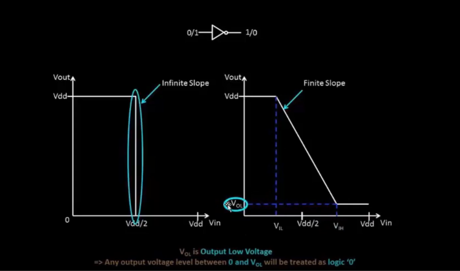
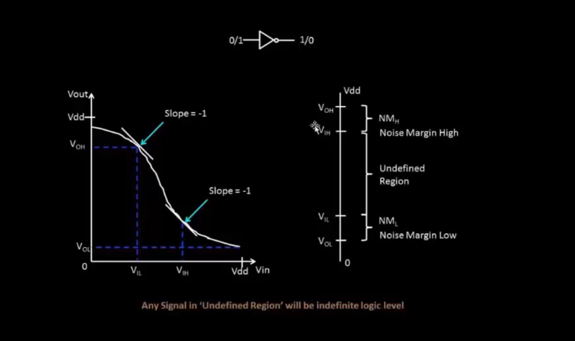
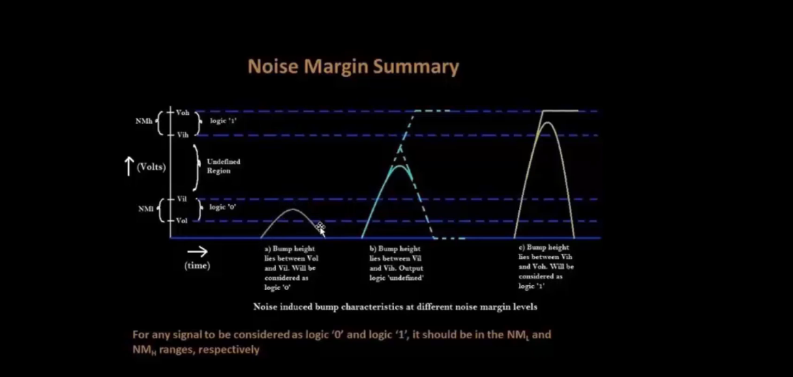

# VSD Hardware Design Program

## Static Behavior Evaluation: CMOS Inverter Robustness and Noise Margin

### 📚 Contents

- [Introduction to noise margin](#introduction-to-noise-margin)
- [Noise Margin Definition — VTC and Undefined Region](#noise-margin-definition--vtc-and-undefined-region)
- [Noise Margin Summary — Handling Input "Bumps"](#noise-margin-summary--handling-input-bumps)
- [Sky130 Noise margin labs](#sky130-noise-margin-labs)
  
### `Introduction to noise margin`

Noise margin is the maximum noise voltage a CMOS circuit can tolerate without logic errors.



This image compares:

**Ideal I/O characteristic** of an inverter with **infinite slope** — abrupt switching at `Vdd/2` (left side)

**Actual inverter characteristic** with **finite slope** — gradual transition region (right side)

### `Noise Margin Definition — VTC and Undefined Region`

This figure illustrates how **Noise Margin** is derived from the **Voltage Transfer Characteristic (VTC)** of a CMOS inverter.



✅ The left plot shows:

- The slope of the VTC = **−1** at two critical points:
  - `VIL`: Input Low Threshold Voltage
  - `VIH`: Input High Threshold Voltage

✅ The right diagram shows:

- **VOH** and **VOL**: Valid output high/low voltage levels
- **VIL** and **VIH**: Input thresholds where the slope = −1

✅ **Noise Margins**:

- `NMH = VOH − VIH`: Noise Margin High — tolerance for noise on logic 1
- `NML = VIL − VOL`: Noise Margin Low — tolerance for noise on logic 0

✅ **Undefined Region**:

- Between `VIL` and `VIH`, the logic level is undefined.
- Any input noise in this region can cause unstable or invalid output.
- Designers aim to **maximize NMH/NML** to improve circuit robustness.

 Noise margins quantify how much noise a logic signal can tolerate before causing errors — ensuring **reliable logic levels** in noisy environments.

### `Noise Margin Summary — Handling Input "Bumps"`

This figure summarizes how **Noise Margins** help handle noisy "bumps" on signals — ensuring correct logic detection.



✅ **Input thresholds**:

- `VIL`: Input voltage < Vdd/2 (~10% of Vdd) — treated as **logic '0'**
- `VIH`: Input voltage > Vdd/2 (~90% of Vdd) — treated as **logic '1'**

✅ **Output thresholds**:

- `VOL`: Output voltage near 0V — treated as **logic '0'** for next gate input
- `VOH`: Output voltage near Vdd — treated as **logic '1'** for next gate input

✅ **Noise bump scenarios**:

- **Case (a)**:  
  Bump height lies between `VOL` and `VIL` → signal still treated as **logic '0'**.
  
- **Case (b)**:  
  Bump height lies between `VIL` and `VIH` → output becomes **undefined** (logic unstable).
  
- **Case (c)**:  
  Bump height lies between `VIH` and `VOH` → signal treated as **logic '1'**.

For any signal to be reliably interpreted as **logic '0'** or **logic '1'**, it must stay within the corresponding **Noise Margin (NML or NMH)** range — outside the **undefined region**.

### `Sky130 Noise margin labs`

<details> <summary><strong>day4_inv_noisemargin_wp1_wn036.spice </strong></summary>

```
*Model Description
.param temp=27


*Including sky130 library files
.lib "sky130_fd_pr/models/sky130.lib.spice" tt


*Netlist Description


XM1 out in vdd vdd sky130_fd_pr__pfet_01v8 w=1 l=0.15
XM2 out in 0 0 sky130_fd_pr__nfet_01v8 w=0.36 l=0.15


Cload out 0 50fF

Vdd vdd 0 1.8V
Vin in 0 1.8V

*simulation commands

.op

.dc Vin 0 1.8 0.01

.control
run
setplot dc1
display
.endc

.end
```
</details>

📈**plot the waveforms in ngspice**

```shell
ngspice day4_inv_noisemargin_wp1_wn036.spice
plot out vs in
```

Below image is the waveform of VTC curve to get the Noise Margin:


>🤔 **How to Calculate Noise Margin from SPICE VTC Plot ??**

In the interactive **ngspice VTC plot**, you can manually extract values for Noise Margin:

1️⃣ **Click on PMOS slope** (left edge of the transition):  
→ Terminal displays: `x0 = VIL`, `y0 = VOH`

2️⃣ **Click on NMOS slope** (right edge of the transition):  
→ Terminal displays: `x1 = VIH`, `y1 = VOL`


✅ **Noise Margin High (NMH)**:  
`NMH = VOH − VIH = y0 − x1`

✅ **Noise Margin Low (NML)**:  
`NML = VIL − VOL = x0 − y1`
