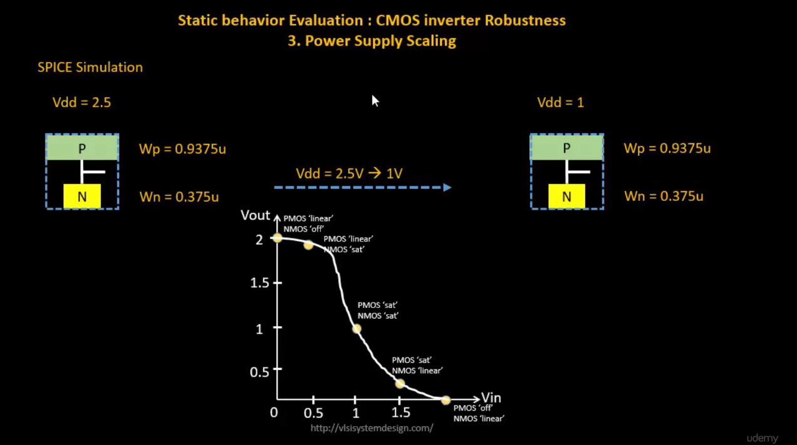
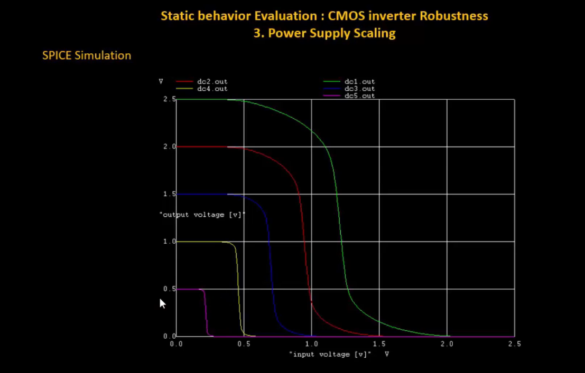
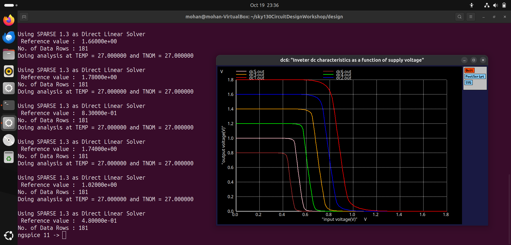
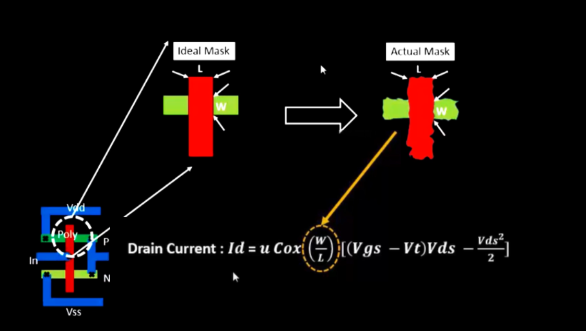
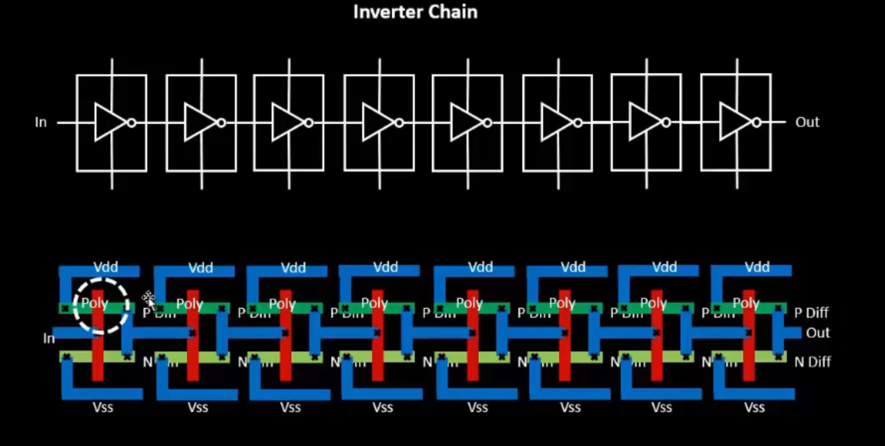
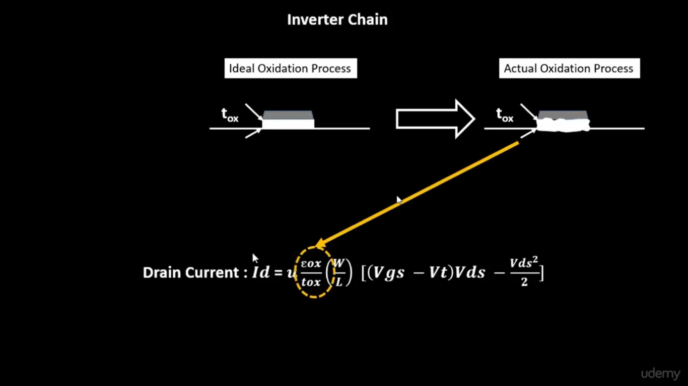
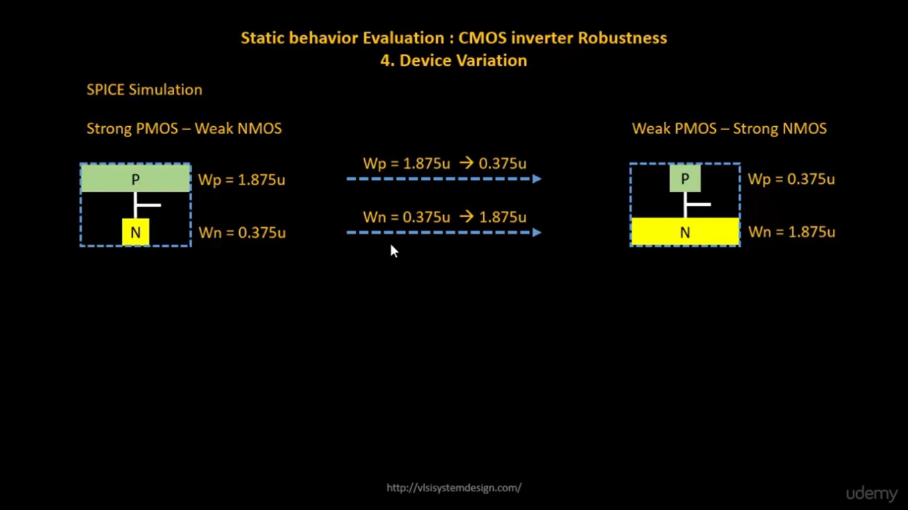
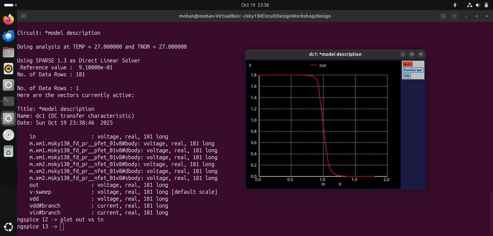

# VSD Hardware Design Program

## CMOS power supply and device variation robustness evaluation

### 📚 Contents

- [Static behaviour evaluation — CMOS inverter robustness — Power supply variation](#static-behaviour-evaluation--cmos-inverter-robustness--power-supply-variation)
  - [Sky130 Supply Variation Labs](#sky130-supply-variation-labs)
- [Static behaviour evaluation — CMOS inverter robustness — Device variation](#static-behaviour-evaluation--cmos-inverter-robustness--device-variation)
  - [Etching Variation](#etching-variation)
  - [Oxide Thickness (T<sub>ox</sub>) Variation](#oxide-thickness-variation)
  - [Transistor Strength Definitions](#transistor-strength-definitions)
  - [Sky130 Device Variation Labs](#sky130-device-variation-labs)
    
### `Static behaviour evaluation — CMOS inverter robustness — Power supply variation`

**Overview:**

Power supply scaling directly affects the **static behavior** of a CMOS inverter — changing its switching threshold (Vm), noise margins, and overall robustness.

**SPICE Simulation:**

- The CMOS inverter is simulated at two different supply voltages:  
  `Vdd = 2.5V` → scaled down to `Vdd = 1V`
- PMOS and NMOS sizes remain constant:  
  - `Wp = 0.9375 μm`, `Wn = 0.375 μm`



✅ **Switching Threshold (Vm)**:  
As `Vdd` decreases, the inverter's switching threshold **Vm** tends to move toward the center of the supply range — but noise margins shrink.

✅ **Noise Margins**:  
Lower `Vdd` → reduced noise immunity → circuit becomes more sensitive to noise and supply variations.

✅ **Performance Impact**:  
Low `Vdd` operation reduces static and dynamic power — but limits noise robustness.  
High `Vdd` improves noise margin, but increases power dissipation.

While power scaling is essential for low-power design, it introduces trade-offs in noise margin and reliability — requiring careful balancing in circuit design.

This plot illustrates how the **Voltage Transfer Characteristics (VTC)** of a CMOS inverter shift with **different power supply levels (Vdd scaling)** — showing progressive reduction in noise margins as Vdd decreases.



**Advantages of using 0.5V supply:**

Using **lower Vdd (0.5V)** provides benefits like **~50% gain improvement** and **~90% reduction in energy consumption**, demonstrating the efficiency of power supply scaling in CMOS inverters.

**Disadvantage of using 0.5V supply**:

- While lowering Vdd improves gain and energy efficiency, it introduces **performance impact** — circuits may switch slower due to reduced drive strength.

### `Sky130 Supply Variation Labs`

<details> <summary><strong>day5_inv_supplyvariation_Wp1_Wn036.spice</strong></summary>

```
*Model Description
.param temp=27

*Including sky130 library files
.lib "sky130_fd_pr/models/sky130.lib.spice" tt

*Netlist Description

XM1 out in vdd vdd sky130_fd_pr__pfet_01v8 w=1 l=0.15
XM2 out in 0 0 sky130_fd_pr__nfet_01v8 w=0.36 l=0.15

Cload out 0 50fF

Vdd vdd 0 1.8V
Vin in 0 1.8V

.control

let powersupply = 1.8
alter Vdd = powersupply
let voltagesupplyvariation = 0
dowhile voltagesupplyvariation < 6
    dc Vin 0 1.8 0.01
    let powersupply = powersupply - 0.2
    alter Vdd = powersupply
    let voltagesupplyvariation = voltagesupplyvariation + 1
end

plot dc1.out vs in dc2.out vs in dc3.out vs in dc4.out vs in dc5.out vs in dc6.out vs in xlabel "input voltage(V)" ylabel "output voltage(V)" title "Inverter dc characteristics as a function of supply voltage"

.endc

.end
```
</details>

📈**plot the waveforms in ngspice**

```shell
ngspice day5_inv_supplyvariation_Wp1_Wn036.spice
```

Below image is waveform for different supplies:



🤔**How to Calculate Gain from SPICE VTC Plot??**

To calculate the gain of the CMOS inverter from the Voltage Transfer Characteristics:

1️⃣ **Click on PMOS slope** (left side of transition) — Terminal displays:  
`x0 = Vin`, `y0 = Vout`

2️⃣ **Click on NMOS slope** (right side of transition) — Terminal displays:  
`x1 = Vin`, `y1 = Vout`

3️⃣ **Compute Gain**:

Gain = (y0 − y1) / (x0 − x1)

### `Static behaviour evaluation-CMOS inverter robustness-Device variation`

#### Device Variation and CMOS Inverter Robustness

**Device variation** is one of the key factors that define the robustness of a CMOS inverter. Variations can occur due to:

- **Etching Variation**
- **Oxide Thickness Variation**

### `Etching Variation`

- **Etching** is a critical step in semiconductor fabrication.
- It defines the **physical structures** in the CMOS layout — such as **Width (W)** and **Length (L)** of transistors.

During fabrication, small deviations can occur between the **designed** and **actual** dimensions:

- **P-diffusion region** → defines the **width of PMOS gate**  
- **N-diffusion region** → defines the **width of NMOS gate**  
- **Poly-silicon layer thickness** → defines the **gate length (L)**, which corresponds to the technology node (e.g., 20nm, 30nm, 45nm).

Other key layout features impacted by etching:

- **Metal layers**
- **Contacts between layers**

#### Impact on Device Performance

- The **actual W and L** of fabricated transistors often differ from ideal values.
- Since **drain current (Id)** depends on **W** and **L**, etching variations directly affect the transistor current.
- This leads to variations in the CMOS inverter’s:

  - **Switching Threshold (Vm)**
  - **Noise Margins**
  - **Overall robustness and performance**
 
This image illustrates **etching variation** in CMOS fabrication — showing the difference between the **ideal mask (design)** and the **actual fabricated structure**.  
Variations in **W (width)** and **L (length)** occur due to process limitations, impacting **device performance** and **current drive**.



This image shows an **Inverter Chain** — a sequence of multiple CMOS inverters connected in series.  
The bottom view illustrates the **physical layout** of each inverter in the chain, showing key layers:  
Poly (Gate), P-Diffusion, N-Diffusion, VDD, VSS.  
Such chains are commonly used to study **delay**, **robustness**, and **variations** across multiple stages of logic.



### `Oxide Thickness Variation`

During MOSFET fabrication, there is often a difference between the **ideal oxide thickness** of the gate and the **actual oxide thickness** achieved.

Since **I<sub>d</sub>** depends on **C<sub>ox</sub>** (oxide capacitance), any variation in oxide thickness directly impacts the drain current (I<sub>d</sub>), thereby affecting the performance of the CMOS inverter.

The image below illustrates the difference between **ideal** and **actual** oxide thickness during fabrication:



These **two minimal variations** — *etching variation* (impacting W and L) and *oxide thickness variation* — play a key role in defining the **robustness** of CMOS inverters.

Next, let's perform a **sweep of the PMOS and NMOS widths** as shown below:



### `Transistor Strength Definitions:`

- **Strong PMOS**:
  - Lower resistance PMOS — provides an easier path to charge the output capacitor.
  - Achieved by using a **wider PMOS**.

- **Weak NMOS**:
  - Higher resistance NMOS — since **resistance is inversely proportional to area**.
  - Achieved by using a **narrower NMOS**.

- **Weak PMOS**:
  - Higher resistance PMOS.
  - Achieved by using a **narrower PMOS**.

- **Strong NMOS**:
  - Lower resistance NMOS.
  - Achieved by using a **wider NMOS**.

### `Sky130 Device Variation Labs`

<details> <summary><strong>day5_inv_supplyvariation_Wp1_Wn036.spice</strong></summary>

```
*Model Description
.param temp=27

*Including sky130 library files
.lib "sky130_fd_pr/models/sky130.lib.spice" tt

*Netlist Description

XM1 out in vdd vdd sky130_fd_pr__pfet_01v8 w=7 l=0.15
XM2 out in 0 0 sky130_fd_pr__nfet_01v8 w=0.42 l=0.15

Cload out 0 50fF

Vdd vdd 0 1.8V
Vin in 0 1.8V

*simulation commands
.op

.dc Vin 0 1.8 0.01

.control
run
setplot dc1
display
.endc

.end
```
</details>

📈**plot the waveforms in ngspice**

```shell
ngspice day5_inv_devicevariation_Wp7_Wn042.spice
plot out vs in
```

Below image is output waveform of device variation:



As the **PMOS width** is larger than the **NMOS width**, the PMOS provides a stronger pull-up path — causing the output to stay high for a longer duration when compared to the NMOS curve.


