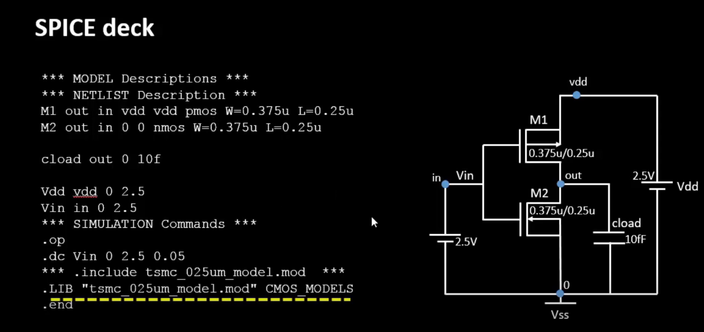
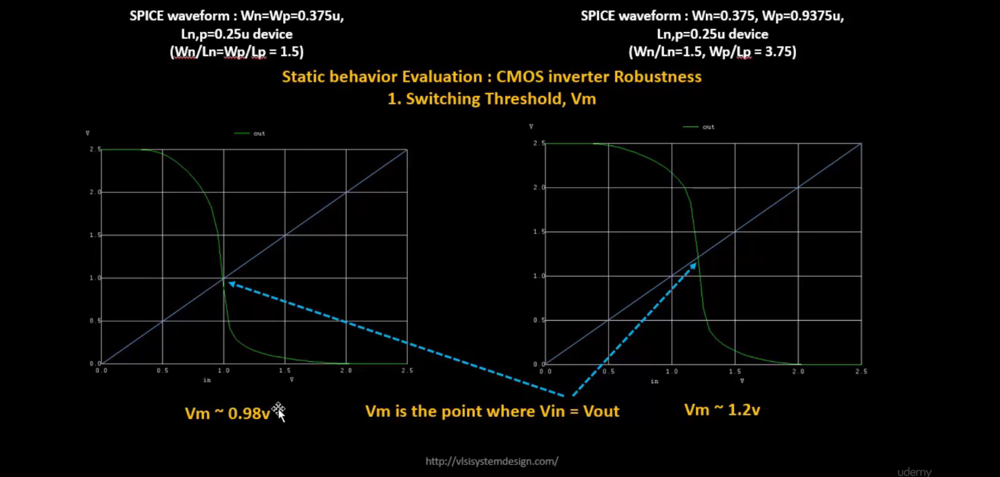
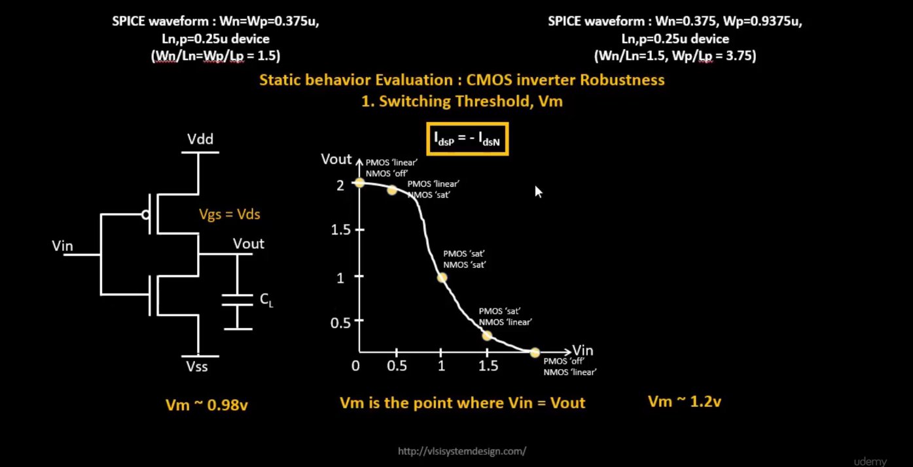
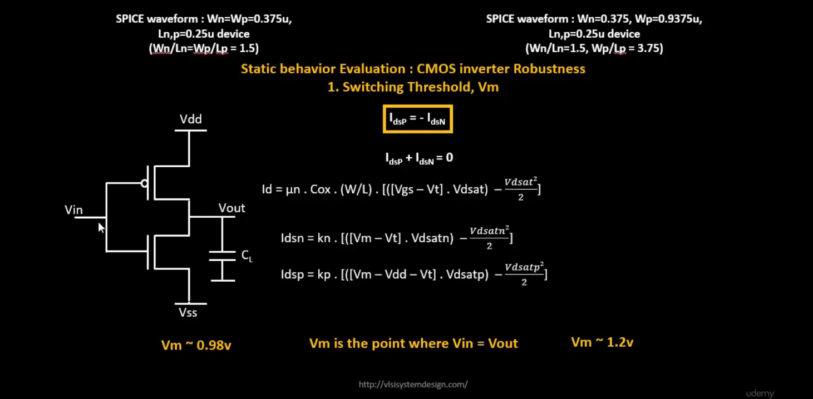
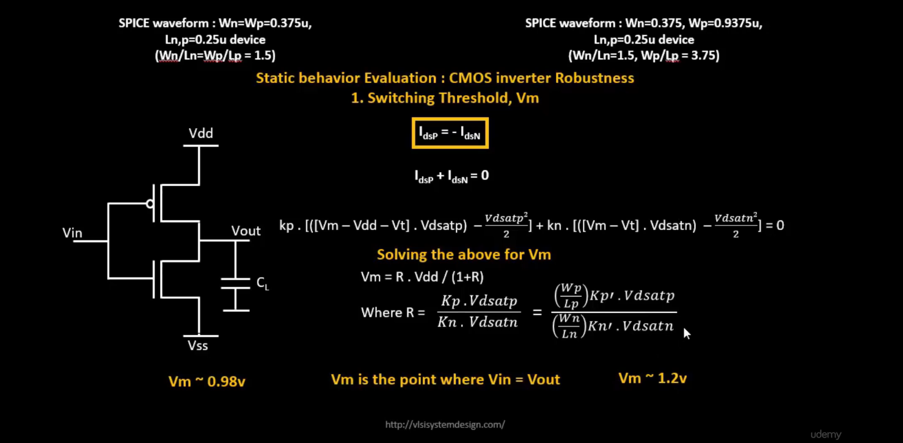
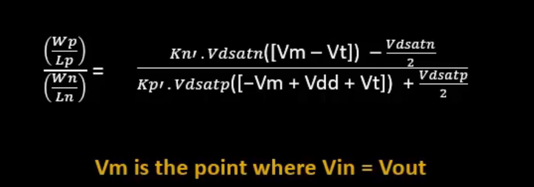
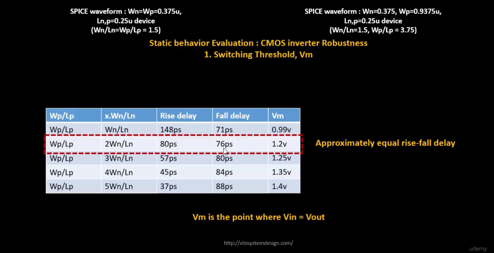
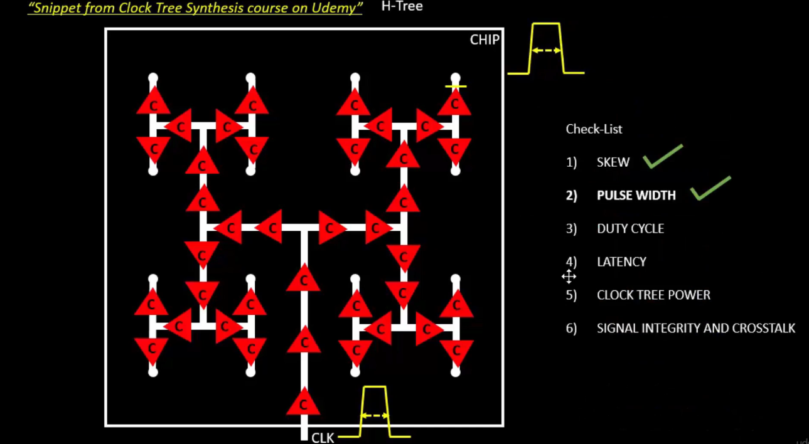

# VSD Hardware Design Program

## CMOS Switching threshold and and dynamic simulations

### 📚 Contents

- [Voltage Transfer Characteristics and Spice simulations](#voltage-transfer-characteristics-and-spice-simulations)
- [Labs Sky130 SPICE simulation for CMOS](#labs-sky130-spice-simulation-for-cmos)
  - [Comparison of Voltage Transfer Characteristics (.dc) vs. Transient Response (.tran) Simulations](#comparison-of-voltage-transfer-characteristics-dc-vs-transient-response-tran-simulations)
- [Static behavior evaluation — CMOS inverter robustness — Switching threshold voltage](#static-behavior-evaluation--cmos-inverter-robustness--switching-threshold-voltage)

### `Voltage Transfer Characteristics and Spice simulations`

#### CMOS Inverter SPICE Deck

This image illustrates how to construct a SPICE deck for a CMOS inverter.

- **Component Connectivity**: Define how PMOS (M1), NMOS (M2), power supply (Vdd), ground (Vss), input (Vin), and output (Vout) are connected.
- **Component Values**: Specify transistor dimensions (W/L), supply voltages (e.g., 2.5V), and load capacitance (Cload = 10fF).
- **Identify Nodes**: Recognize each node in the circuit — such as `in`, `out`, `vdd`, `vss`, and transistor terminals.
- **Name Nodes**: Assign clear names to all nodes for ease of reference during simulation and result interpretation.

This forms the foundation of writing an accurate and functional SPICE netlist for CMOS circuit simulations.


#### CMOS Inverter SPICE Deck Example

This image shows a complete SPICE deck and corresponding CMOS inverter circuit.



**Key Sections of the SPICE Deck:**

1. **Model & Netlist Description:**
    - `M1 out in vdd vdd pmos W=0.375u L=0.25u`: PMOS transistor M1 with width 0.375µm, length 0.25µm. Connected between VDD and output node (`out`), gate connected to input (`in`), bulk tied to VDD.
    - `M2 out in 0 0 nmos W=0.375u L=0.25u`: NMOS transistor M2 with same dimensions, connected between ground and output, gate connected to input, bulk tied to ground.
    - `cload out 0 10f`: Load capacitor (10 fF) connected between output node and ground.

2. **Voltage Sources:**
    - `Vdd vdd 0 2.5`: DC supply voltage of 2.5V between VDD and ground.
    - `Vin in 0 2.5`: DC input voltage, swept during the simulation.

3. **Simulation Commands:**
    - `.op`: Perform operating point analysis (DC bias point).
    - `.dc Vin 0 2.5 0.05`: Perform a DC sweep of `Vin` from 0V to 2.5V in 0.05V steps to generate voltage transfer characteristics (VTC).

4. **Model Inclusion:**
    - `.include tsmc_025um_model.mod`: Include technology model file with parameters for the transistors.
    - `.LIB "tsmc_025um_model.mod" CMOS_MODELS`: Another way to reference the technology model.

5. **End Statement:**
    - `.end`: End of SPICE deck.

### `Labs Sky130 SPICE simulation for CMOS`

<details> <summary><strong>day3_inv_vtc_Wp084_Wn036.spice </strong></summary>

```
*Model Description
.param temp=27


*Including sky130 library files
.lib "sky130_fd_pr/models/sky130.lib.spice" tt


*Netlist Description


XM1 out in vdd vdd sky130_fd_pr__pfet_01v8 w=0.84 l=0.15
XM2 out in 0 0 sky130_fd_pr__nfet_01v8 w=0.36 l=0.15


Cload out 0 50fF

Vdd vdd 0 1.8V
Vin in 0 1.8V

*simulation commands

.op

.dc Vin 0 1.8 0.01

.control
run
setplot dc1
display
.endc

.end
```
</details>

📈**plot the waveforms in ngspice**

```shell
ngspice day3_inv_vtc_Wp084_Wn036.spice
plot out vs in
```

Below image shows the Voltage Transfer Characteristics (VTC) of a CMOS Inverter:


<details> <summary><strong>day3_inv_tran_Wp084_Wn036.spice </strong></summary>

```
*Model Description
.param temp=27


*Including sky130 library files
.lib "sky130_fd_pr/models/sky130.lib.spice" tt


*Netlist Description


XM1 out in vdd vdd sky130_fd_pr__pfet_01v8 w=0.84 l=0.15
XM2 out in 0 0 sky130_fd_pr__nfet_01v8 w=0.36 l=0.15


Cload out 0 50fF

Vdd vdd 0 1.8V
Vin in 0 PULSE(0V 1.8V 0 0.1ns 0.1ns 2ns 4ns)

*simulation commands

.tran 1n 10n

.control
run
.endc

.end
```
</details>

📈**plot the waveforms in ngspice**

```shell
ngspice day3_inv_tran_Wp084_Wn036.spice
plot out vs time in
```

Below image shows the output waveform of transient analysis of a CMOS inverter, illustrating rise time delay and fall time delay:

**How to calculate rise time and fall time from the transient analysis:**

- Output **rise time delay** = Time at 50% of rising edge − Time at 50% of falling edge  
- Output **fall time delay** = Time at 50% of falling edge − Time at 50% of rising edge  


<a name="comparison-vtc-vs-tran"></a>

### Comparison of Voltage Transfer Characteristics (.dc) vs. Transient Response (.tran) Simulations

| Aspect                    | Voltage Transfer Characteristics (DC Sweep)          | Transient Response (Dynamic Simulation)                                  |
|---------------------------|-----------------------------------------------------|-------------------------------------------------------------------------|
| Simulation Type           | DC Sweep (Voltage Transfer Characteristics - VTC)    | Transient (Dynamic behavior over time)                                   |
| Input Signal (`Vin`)      | Fixed DC sweep: 0V to 1.8V in 0.01V steps             | Pulse waveform: 0V to 1.8V, 2ns width, 4ns period                        |
| Simulation Command        | `.dc Vin 0 1.8 0.01`                                 | `.tran 1n 10n`                                                           |
| Purpose                   | Plot static VTC curve of CMOS inverter               | Analyze rise/fall times and delays under dynamic switching                |
| Typical Output            | Vout vs Vin graph                                    | Vout vs Time, Vin vs Time waveforms                                       |
| Analysis Goal             | Understand switching threshold & noise margins       | Measure timing parameters (propagation delay, rise time, fall time)       |


### `Static behavior evaluation — CMOS inverter robustness — Switching threshold voltage`

The characteristics that define the **CMOS inverter robustness** are:

- **Switching Threshold Voltage (Vm)**
- **Noise Margin**
- **Power Supply Variation**
- **Device Variations**

#### Switching Threshold Voltage of CMOS Inverter (Vm):

- The **Switching Threshold Voltage (Vm)** is the voltage at which the input voltage equals the output voltage:  
  `Vin = Vout`
- It is an important parameter that impacts the noise margin and robustness of the inverter.
- At **Vm**, both the NMOS and PMOS transistors are operating in the **saturation region**, and both are turned **ON**, giving high voltage gain.

The image compares two CMOS inverters with different PMOS/NMOS sizing:



  1. **Left graph**:  
     - `Wn = Wp = 0.375 μm`, `Ln = Lp = 0.25 μm`  
     - `(W/L)n = (W/L)p = 1.5` (equal aspect ratios)  
     - Resulting `Vm ≈ 0.98 V`

  2. **Right graph**:  
     - `Wn = 0.375 μm`, `Wp = 0.9375 μm`, `Ln = Lp = 0.25 μm`  
     - `(W/L)p = 3.75`, `(W/L)n = 1.5`  
     - Resulting `Vm ≈ 1.2 V`

**Regions of operation:**

- Different regions of the curve correspond to the transistor operating regions:
  - **PMOS Linear / NMOS OFF**
  - **PMOS Linear / NMOS Saturation**
  - **PMOS Saturation / NMOS Saturation** — This is where `Vm` is located.
  - **PMOS Saturation / NMOS Linear**
  - **PMOS OFF / NMOS Linear**



**Current balance at Vm:**

- At `Vm`, the condition:  
  `Idsp = -Idsn`  
  is satisfied — the current through **PMOS** equals the current through **NMOS** in magnitude but opposite in direction.

We are evaluating this at Vm, so `Vgs = Vm` for NMOS and `Vgs = Vm − Vdd` for PMOS



Equating **Idsp + Idsn = 0** and solving for **R**, we can express **Vm** as a function of the sizing ratio and mobility factors.



This expression shows how the required **(Wp/Lp) / (Wn/Ln)** ratio can be computed for a given **Vm**, by balancing NMOS and PMOS currents at the switching threshold point **(Vin = Vout = Vm)**.



This table shows how varying the **Wp/Wn ratio** affects:

✅ Rise Delay  
✅ Fall Delay  
✅ Switching Threshold Voltage (Vm)

- When **Wp/Lp ≈ 2 × Wn/Ln**, the inverter achieves **balanced rise and fall delays** (≈ 80 ps each).
- At this point, the switching threshold **Vm ≈ 1.2 V**.



If the **rise delay** and **fall delay** of the clock buffer are well-matched, no **duty cycle distortion** correction is needed.  

However, if they are imbalanced due to PMOS/NMOS `Ron mismatch`, **duty cycle correction** circuits are used in the clock tree to maintain a 50% duty cycle.


